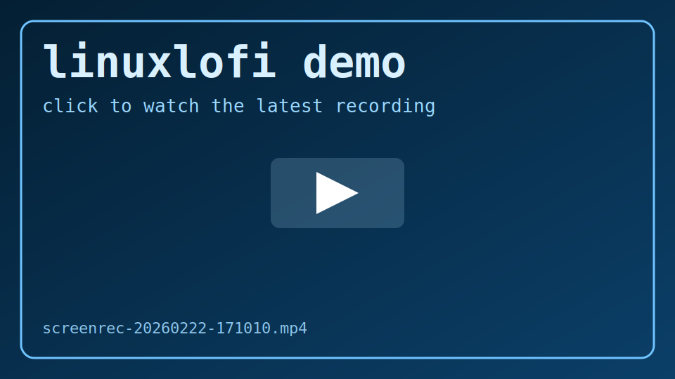

# linuxlofi

`linuxlofi` is a lightweight terminal lo-fi workstation:
- htop-style TUI with 8 horizontal visualizer bars
- real process list from your machine (`ps`-based)
- procedural lo-fi generator (notes + instruments only, no SFX)
- adaptive composition using live CPU/RAM/GPU/VRAM stats
- 10 built-in track presets with auto-rotation every 5 minutes
- `t` key to force an instant preset/track change

## Demo

GitHub-friendly inline preview (click to play):

[](demo/screenrec-20260222-171010.mp4)

Direct file link:
- [`demo/screenrec-20260222-171010.mp4`](demo/screenrec-20260222-171010.mp4)

## One-line installer

```bash
curl -fsSL https://raw.githubusercontent.com/JohnDSdev/linuxlofi/main/install.sh | bash
```

## Requirements

- Linux
- `python3`
- `ps` (procps)
- audio backend: `pw-play` (PipeWire) or `aplay` (ALSA)
- optional GPU metrics: `nvidia-smi` (if NVIDIA is present)

## OS support

- Linux (native): supported.
- Windows (native): not supported.
- macOS (native): not supported.
- BSDs (native): not supported.

`linuxlofi` currently depends on Linux-specific interfaces (`/proc`, PipeWire/ALSA defaults, and Linux-oriented process metrics), so non-Linux native support is intentionally not claimed.

## Usage

Start TUI:

```bash
linuxlofi
```

Start TUI without auto-starting music engine:

```bash
linuxlofi --no-music
```

Palette/color examples:

```bash
linuxlofi --palette scifi
linuxlofi --palette auto
linuxlofi --bar-color blue --peak-color white --text-color cyan
```

Toggle standalone music engine (background):

```bash
linuxlofi-music
```

Serve the original web UI on localhost:

```bash
linuxlofi-webui 4173
# open http://127.0.0.1:4173
```

## Controls

- `q`: quit
- `t`: force next track preset
- `c`: cycle palette (when explicit custom colors are not set)

## How it works

- `src/fractal_music.py` synthesizes lo-fi audio in real-time and writes:
  - PCM stream to `pw-play` or `aplay`
  - sync state to `/tmp/linuxlofi-state.json`
- `src/linuxlofi.py` renders the TUI with `curses` and consumes sync state.
- When synced state is present, bars map to musical components:
  - kick energy
  - bass/sub movement
  - pad/key density
  - snare/hat intensity
  - combined master energy
- Adaptive behavior by utilization:
  - CPU -> low-end drive + kick intensity
  - RAM -> pad warmth/density
  - GPU -> melodic movement
  - VRAM -> snare/hat sparkle
- Tempo and arrangement react to weighted utilization and rotate presets every 300s.

## Hyprland integration (optional)

Super+M toggle example:

```ini
bindd = $mainMod, M, toggle linuxlofi music, exec, linuxlofi-music
```

Force track change from terminal:

```bash
touch /tmp/linuxlofi-next-track.flag
```

## Portability notes

This repo is designed to run on most modern Linux setups without distro-specific tooling.
If `pw-play` is unavailable, it falls back to `aplay`. If `nvidia-smi` is missing, GPU/VRAM metrics gracefully fall back to zero while audio still runs.
